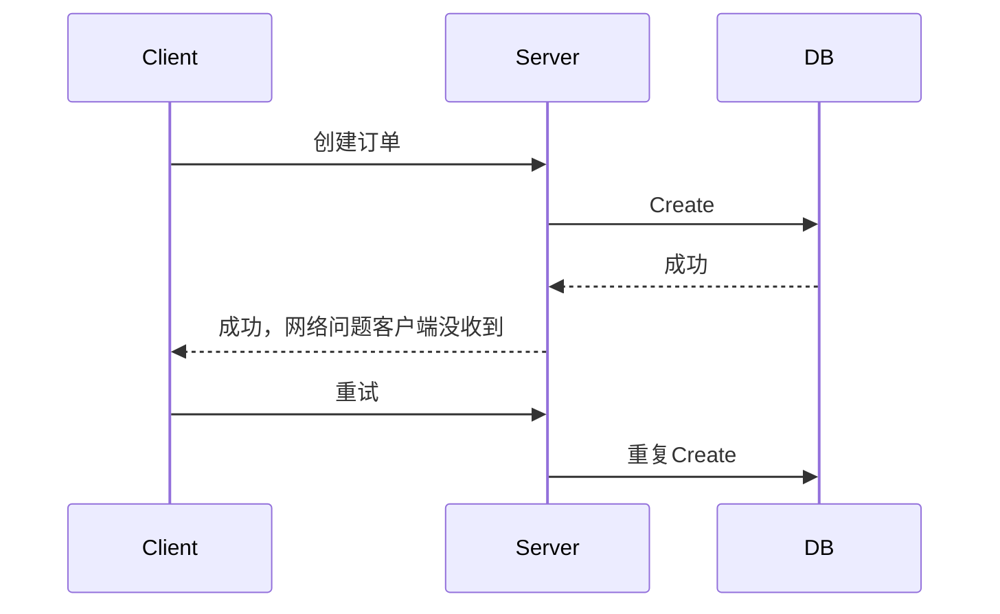
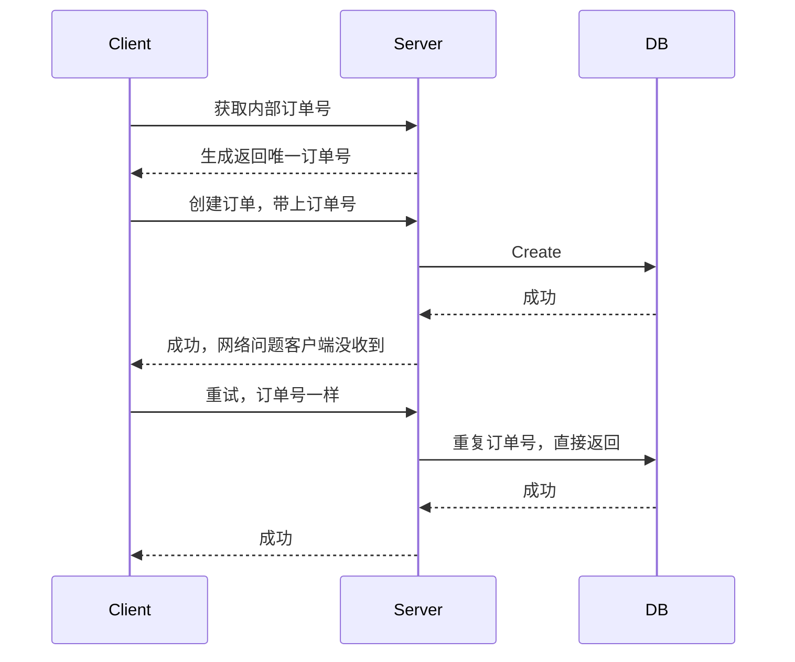
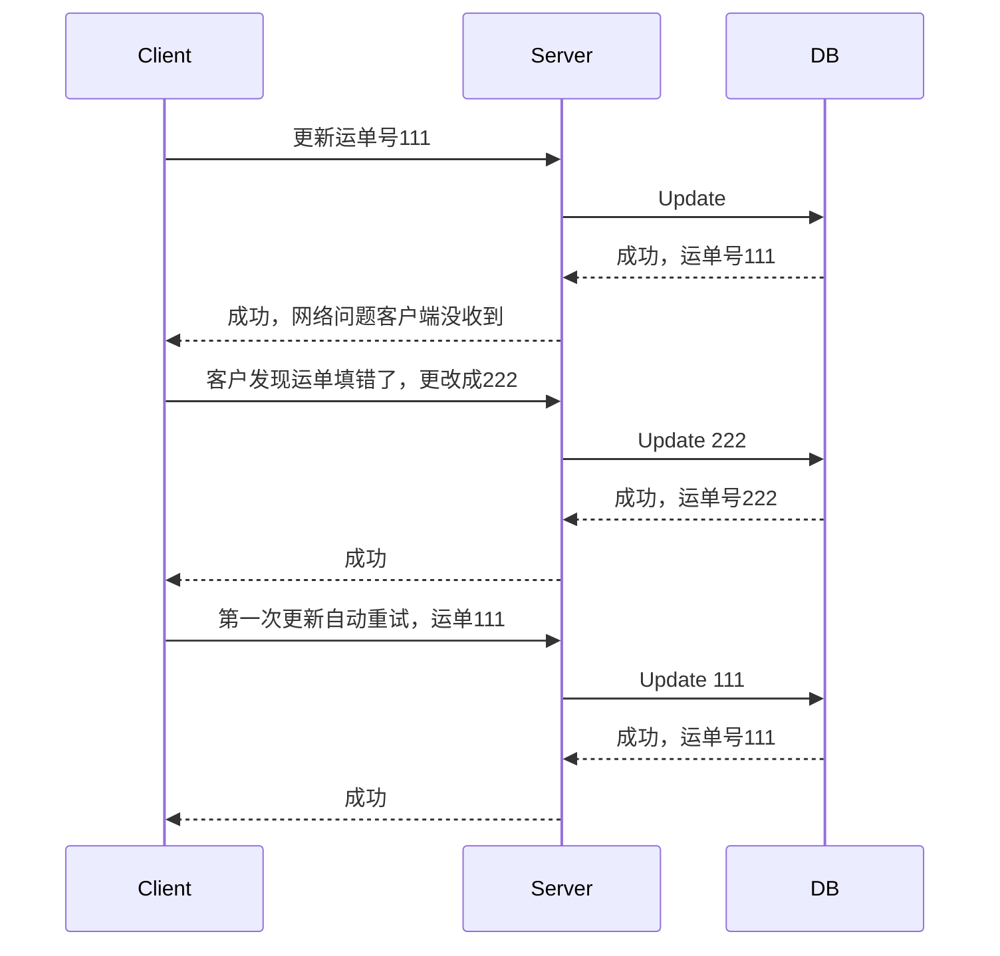
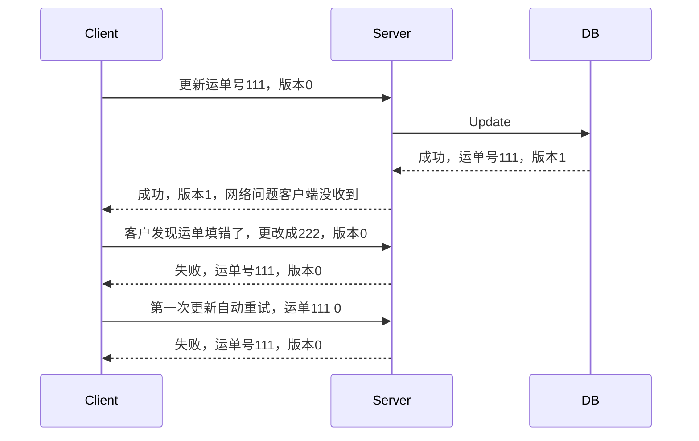

---
{"publish":true,"title":"后端存储如何保证数据幂等","created":"2025-08-27T16:07:46.337+08:00","modified":"2026-01-06T09:16:07.808+08:00","tags":["复习回顾","web"],"cssclasses":""}
---

## 重复请求，存储重复数据

### 解决方案

利用数据库唯一键，添加订单号作为主键。避免重复创建。

如果前端重新获取了订单号，业务方可加入逻辑判断，是否存在订单。

## 更新操作 ABA 情况

### 解决方案

表结构加上 Version 自增字段，前端调用时带上改值。
每次调用时校验改值，版本号对不上直接返回失败。

#复习回顾 #web